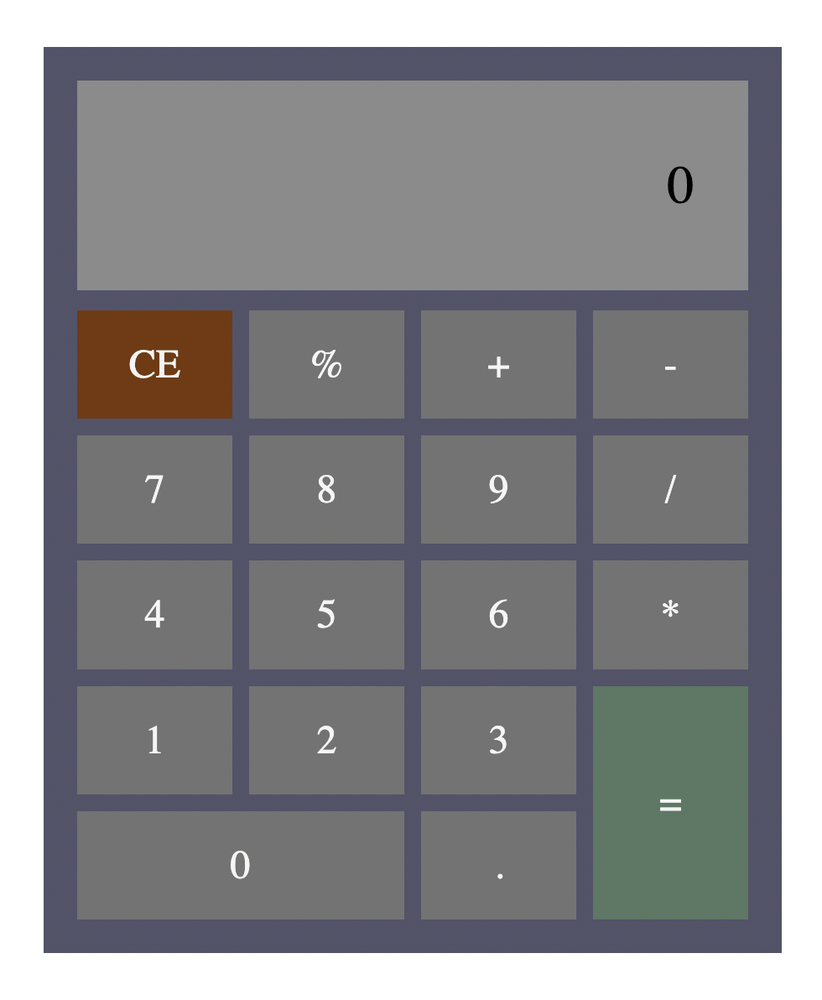

# Odin Project - Calculator solution

This is a solution to the [Calculator project on Odin Project](https://www.theodinproject.com/lessons/foundations-calculator). Odin Project is a web development pathway course.

## Table of contents

- [Odin Project - Calculator solution](#odin-project---calculator-solution)
  - [Table of contents](#table-of-contents)
  - [Overview](#overview)
    - [Screenshot](#screenshot)
    - [Links](#links)
  - [My process](#my-process)
    - [Built with](#built-with)
    - [What I learned](#what-i-learned)
    - [Continued development](#continued-development)
  - [Author](#author)
  - [Acknowledgments](#acknowledgments)

## Overview

### Screenshot



### Links

- Solution URL: [Solution](https://lrvaka.github.io/odin-calculator/)

## My process

I started the project with the HTML structure. My goal was simplicity, using the least amount of HTML. All buttons shared the same class, with the specialty buttons having an extra class unique to their placement and color. I added a data-value attribute to each button with their corresponding values (1-9, +, -, *, etc.)
```html
 <div class="btn clear" data-value="CE">CE</div>
            <div class="btn" data-value="%">%</div>
``` 
which will be retrieved in the Javascript. I used CSS Grid to place each button accordingly, with some buttons spanning multiple rows and columns.

In the Javascript, I created the individual add, subtract, multiply, etc. functions, each accepting two arguments, both numbers for a given operation. 
```js
const add = (a, b) => a + b
const subtract = (a, b) => a - b
const multiply = (a, b) => a * b
const divide = (a, b) => a / b
const modulo = (a, b) => a % b
```
I then created a Higher Order Function accepting three arguments, the operator, and two numbers, which returned the value returned from one of the functions mentioned above, dependant on the operator entered. 

```js
const operate = (operator, a, b) => {
  if (operator === "+") return add(a, b)
  if (operator === "-") return subtract(a, b)
  if (operator === "*") return multiply(a, b)
  if (operator === "/") return divide(a, b)
  if (operator === "%") return modulo(a, b)
}
```

From there I created an event listener to the buttons grid and used event delegation to identify which button was clicked and retrieved the value from data-value to identify what operation and functionality must be completed. I won't go into much detail, but this was the most difficult part, displaying the value, allowing for back to back operations, accounting for any possible edge cases, this took a good portion of time, but was worth it in the end.

### Built with

- Semantic HTML5 markup
- CSS Grid
- Flexbox
- Javascript

### What I learned

The project was a great experience overall. I didn't learn any new concepts, but I did learn a valuable lesson about problem solving. I learned that if you're stuck on a problem and you feel frustrated, that is exactly the point in which your brain is on overdrive and will eventually make the breakthrough you are looking for, it is important that you bask in that frustration and keep your mind on that given problem. 

The biggest problem I had during this project was figuring out how values shifted from calculation to calculation and which number is being iterated upon and which value is the new value. When I tried to work on one edge case, it was cause other cases to break sometimes, so it was a whole mess of trial and error. Luckily I was able to stick with it and have a fully functioning calculator in the end.


### Continued development

I believe I have a strong grasp of Javascript concepts and syntax as of now. In the future, I need to study up on algorithms and data structures as a whole so I am able to create cleaner and more efficient code. I think I'm on a good trajectory, but pinpointing my weaknesses is going to be key in becoming a full-time web developer. Thanks for reading!

## Author

- Website - [Luke Vakasisikakala](https://lrvaka.com/)
- Frontend Mentor - [@lrvaka](https://www.frontendmentor.io/profile/lrvaka)

## Acknowledgments

Mum.
